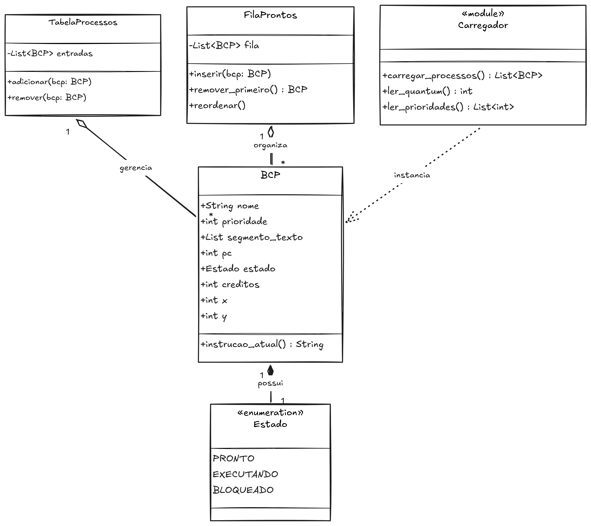

# Módulo escalonador (núcleo do sistema)

Esta pasta contém o núcleo lógico do nosso SO fictício. É aqui que residem as estruturas de dados fundamentais e as regras de negócio responsáveis por carregar os programas da memória, gerenciar o estado de cada processo e organizar as filas de execução.

## Estrutura de arquivos

Abaixo está a descrição detalhada do papel de cada arquivo dentro deste módulo:

* **`bcp.py` (bloco de controle de processo):**
  Define a estrutura de dados central do sistema. O `BCP` funciona como a "ficha de salvamento" de um programa, armazenando seus metadados (como nome, prioridade e estado atual) e o seu **contexto de hardware** (os registradores `X` e `Y`, os créditos restantes e o `PC` - *program counter*). Também contém o `Enum` que trava os estados possíveis do processo (`Pronto`, `Executando`, `Bloqueado`).

* **`estruturas.py` (gerenciadores de coleções):**
  Implementa as classes que agrupam e organizam os processos:
  * `TabelaProcessos`: O "fichário" global que contém a referência de absolutamente todos os processos vivos no sistema, independentemente de onde eles estejam.
  * `FilaProntos`: A fila de prioridade que ordena os processos baseando-se na quantidade de créditos restantes (do maior para o menor), desempatando por ordem de chegada.

* **`carregador.py` (módulo de I/O e validação):**
  Responsável por fazer a ponte entre o disco (arquivos `.txt`) e a memória. Ele varre a pasta `programas`, valida se as instruções escritas nos arquivos pertencem ao *set* de instruções da máquina fictícia (`X=`, `Y=`, `COM`, `E/S`, `SAIDA`), e instancia os objetos `BCP` iniciais, distribuindo as prioridades.

* **`__init__.py` (ponto de exportação):**
  Transforma esta pasta em um módulo Python formal, criando uma vitrine (através da variável `__all__`) que expõe apenas as classes e funções que o arquivo principal (`Escalonador.py`) tem permissão para acessar.

## Diagrama de classes (arquitetura)

O diagrama abaixo ilustra como as estruturas deste módulo se relacionam. O `carregador` lê os arquivos e cria os `BCPs`, que por sua vez são armazenados na `tabela de processos` e organizados para execução pela `fila de prontos`.

