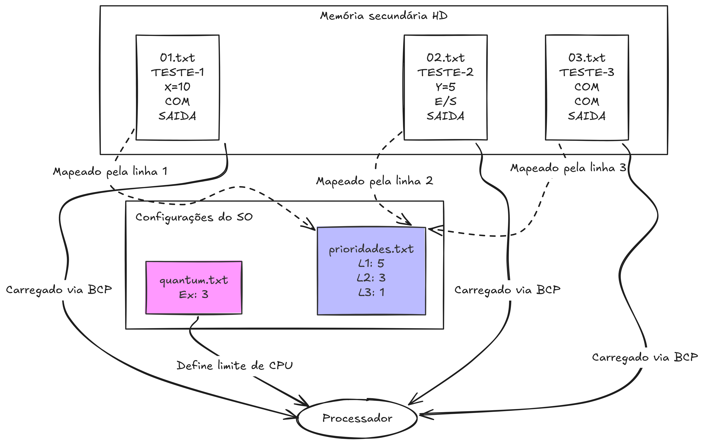

# Diretório de programas (entrada de dados)

Este diretório funciona como o sistema de armazenamento da nossa máquina fictícia. Ele contém os executáveis (em formato de texto) e os arquivos de configuração que ditam o comportamento do SO durante a inicialização.

## Estrutura dos arquivos

O escalonador espera encontrar três tipos de arquivos nesta pasta. Qualquer desvio no formato desses arquivos gerará um erro no momento do carregamento (tratado pelo `carregador.py`).

* **`quantum.txt` (configuração de hardware):**
  Contém um único número inteiro positivo. Ele define a cota de tempo da CPU (o *quantum*), ou seja, o número máximo de instruções que qualquer processo tem permissão para rodar ininterruptamente antes de sofrer preempção (ser pausado).

* **`prioridades.txt` (configuração de escalonamento):**
  Uma lista de números inteiros (um por linha). Este arquivo mapeia a prioridade inicial de cada processo. A regra é estritamente posicional: a linha 1 define a prioridade do programa `01.txt`, a linha 2 define a do programa `02.txt`, e assim por diante. Quanto maior o número, maior a prioridade (e a carga inicial de créditos).

* **`NN.txt` (os processos / códigos-fonte):**
  Arquivos nomeados sequencialmente com dois dígitos (`01.txt`, `02.txt`, `10.txt`, etc.). Cada arquivo representa um processo isolado e deve respeitar a seguinte estrutura:
  1. **Linha 1:** O nome do programa (ex: `TESTE-1`).
  2. **Linhas intermediárias:** As instruções válidas para o processador (`X=valor`, `Y=valor`, `COM`, `E/S`). Limitado ao tamanho máximo da memória (21 comandos).
  3. **Última linha:** Obrigatoriamente o comando `SAIDA`, que sinaliza ao SO que o processo foi concluído e deve ser removido da memória.

## Diagrama de relacionamento (I/O)

O diagrama abaixo ilustra como o Carregador do escalonador interpreta a relação entre os arquivos desta pasta:

